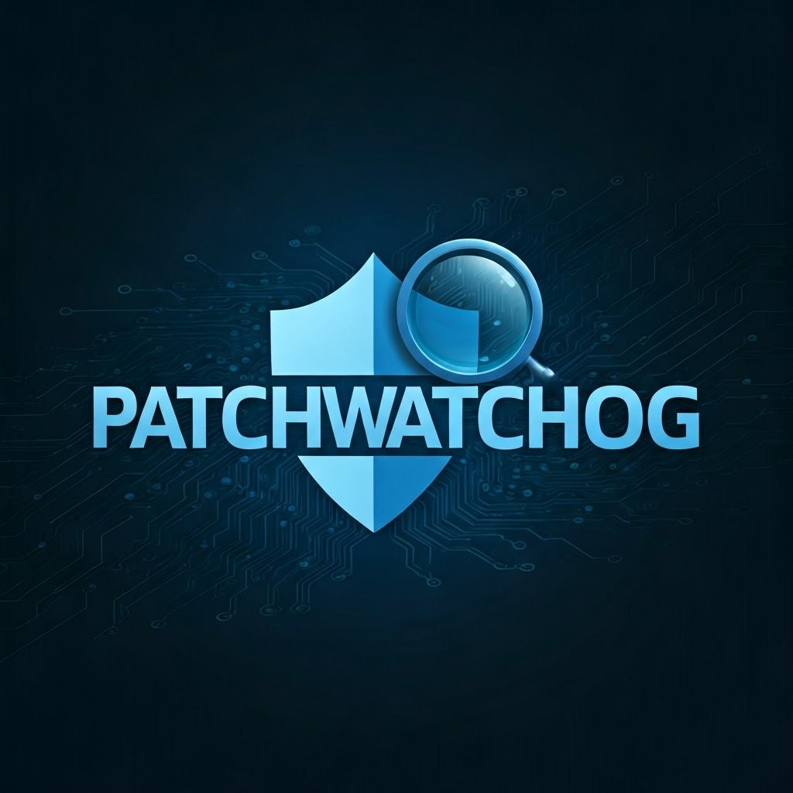

# 🛡 PatchWatchdog

<p align="center">
  
  
  
</p>

<p align="center">
  <b>Surveillance d'état de patch et détection de CVEs</b><br>
  <sub>🔍 Scan des packages | 🔔 Détection de vulnérabilités | ⚡ Alertes en temps réel</sub>
</p>

---

## 📋 Description

**PatchWatchdog** est un outil de ligne de commande conçu pour surveiller l'état des packages installés sur votre système et détecter les vulnérabilités CVE connues. Il s'intègre avec l'API Vulners pour vérifier si vos versions de packages sont exposées à des failles, et peut vous alerter via Slack ou GitHub Issues.

> ⚠️ **Note importante** : Cet outil ne remplace pas une stratégie complète de gestion des correctifs, mais vous aide à garder un œil sur les paquets potentiellement vulnérables.

### 🔍 Fonctionnalités principales

- 📊 **Inventaire des packages** installés (apt, pip sur Linux, Windows Installer)
- 🔬 **Détection automatique** des vulnérabilités via l'API Vulners
- 🔔 **Alertes configurables** : Slack, GitHub Issues
- 🖥️ **Multi-plateforme** : Support Linux et Windows
- 🧰 **Léger et rapide** : Installation et exécution simples

## ⚙️ Installation

### 🐧 Linux

```bash
# Cloner le dépôt
git clone https://github.com/servais1983/PatchWatchdog.git
cd PatchWatchdog

# Configurer les variables d'environnement
cp .env.example .env
# Éditez .env avec vos webhooks et tokens

# Exécuter le script d'installation
chmod +x install.sh
./install.sh
```

### 🪟 Windows

```powershell
# Cloner le dépôt
git clone https://github.com/servais1983/PatchWatchdog.git
cd PatchWatchdog

# Configurer les variables d'environnement
copy .env.example .env
# Éditez .env avec vos webhooks et tokens en utilisant Notepad ou un autre éditeur
# notepad .env

# Exécuter le script d'installation
.\install.bat
```

> 💡 **Note pour Windows** : Assurez-vous que Python est installé et ajouté au PATH. Vous pouvez télécharger Python depuis [python.org](https://www.python.org/downloads/) en cochant l'option "Add Python to PATH" lors de l'installation.

## 🛠️ Utilisation

### Vérification basique

#### 🐧 Linux

```bash
# Vérification sur Linux sans notification
python3 patchwatchdog.py --os linux

# Vérification sur Linux avec notification Slack
python3 patchwatchdog.py --os linux --notify slack

# Vérification avec création d'issue GitHub
python3 patchwatchdog.py --os linux --notify github
```

#### 🪟 Windows

```powershell
# Vérification sur Windows sans notification
python patchwatchdog.py --os windows

# Vérification sur Windows avec notification Slack
python patchwatchdog.py --os windows --notify slack

# Vérification avec création d'issue GitHub
python patchwatchdog.py --os windows --notify github
```

### 📊 Rapports HTML

Un rapport HTML détaillé est automatiquement généré à chaque exécution de PatchWatchdog. Ce rapport inclut :

- Résumé de l'analyse avec statistiques
- Liste des vulnérabilités détectées
- Inventaire complet des packages analysés
- Recommandations de sécurité

Les rapports sont sauvegardés dans le dossier `reports/` avec un horodatage unique.

### 🔄 Vérification et application des mises à jour

PatchWatchdog peut également vérifier et appliquer automatiquement les mises à jour critiques du système :

#### 🐧 Linux

```bash
# Vérifier les mises à jour disponibles
python3 patchwatchdog.py --os linux --check-updates

# Vérifier et appliquer automatiquement les mises à jour critiques
python3 patchwatchdog.py --os linux --auto-update
```

#### 🪟 Windows

```powershell
# Vérifier les mises à jour disponibles
python patchwatchdog.py --os windows --check-updates

# Vérifier et appliquer automatiquement les mises à jour critiques
python patchwatchdog.py --os windows --auto-update
```

> ⚠️ **Note importante** : L'application automatique des mises à jour nécessite des privilèges administratifs. Sur Linux, utilisez `sudo` si nécessaire. Sur Windows, exécutez PowerShell en tant qu'administrateur.

### Variables d'environnement

Pour activer les notifications, configurez les variables d'environnement suivantes dans le fichier `.env` :

```ini
# Pour les notifications Slack
SLACK_WEBHOOK=https://hooks.slack.com/services/XXXXX/XXXXX/XXXXX

# Pour les issues GitHub
GITHUB_TOKEN=ghp_xxx
GITHUB_REPO=tonuser/tonrepo
```

## 🗂️ Structure du projet

```
patchwatchdog/
├── core/                # Modules principaux
│   ├── inventory.py     # Collecte des packages installés
│   ├── scanner.py       # Vérification des versions vulnérables
│   ├── notifier.py      # Envoi des alertes
│   └── utils.py         # Fonctions utilitaires
├── patchwatchdog.py     # Script principal CLI
├── requirements.txt     # Dépendances Python
├── install.sh           # Script d'installation
├── .env.example         # Exemple de configuration
└── README.md            # Documentation
```

## 🔐 Intégrations

### Slack

L'intégration Slack nécessite de créer un webhook entrant dans votre espace de travail :
1. Créez une App dans l'interface Slack Admin
2. Activez les Webhooks entrants
3. Copiez l'URL du webhook dans votre `.env`

### GitHub Issues

L'intégration GitHub Issues nécessite :
1. Un token personnel avec permissions `repo`
2. Le nom du dépôt au format `utilisateur/nom-repo`

## 📈 Améliorations futures

- [ ] **Intégration OSQuery** pour une collecte plus précise des paquets
- [ ] **Support Wazuh** pour la gestion centralisée
- [ ] **Tableau de bord web** avec FastAPI
- [ ] **Base de données Redis** pour l'analyse historique
- [ ] **Alertes différentielles** (uniquement les nouvelles vulnérabilités)
- [ ] **Rapports détaillés** avec scores CVSS et correctifs recommandés

## 🤝 Contribuer

Les contributions sont les bienvenues !! N'hésitez pas à ouvrir une issue ou à soumettre une pull request.

## 📄 Licence

Ce projet est sous licence MIT - voir le fichier LICENSE pour plus de détails.

---

<p align="center">
  <sub>🔐 Développé pour des environnements sécurisés et à jour</sub>
</p>
